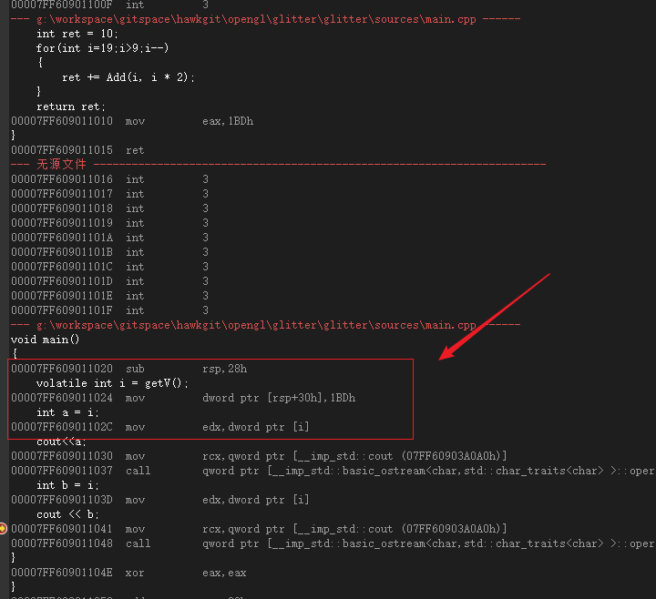

# 目录

<!-- TOC -->

- [目录](#目录)
  - [零、开源项目](#零开源项目)
    - [软渲染器](#软渲染器)
      - [1 UE4工程](#1-ue4工程)
      - [2 Unity工程](#2-unity工程)
      - [3 Android工程 【TODO】](#3-android工程-todo)
    - [软渲染器渲染引擎（TODO）](#软渲染器渲染引擎todo)
    - [Opengl Glitter开源学习（TODO）](#opengl-glitter开源学习todo)
  - [一、知识](#一知识)
    - [js](#js)
    - [Lua](#lua)
    - [C++](#c)
    - [内存池](#内存池)
    - [设计模式](#设计模式)
    - [安卓](#安卓)
    - [SQLite](#sqlite)
    - [图形学](#图形学)
    - [音视频流](#音视频流)
    - [计算机网络](#计算机网络)
    - [项目经历](#项目经历)
    - [编程](#编程)
  - [二、书籍](#二书籍)
    - [计算机网络](#计算机网络-1)
      - [《图解http》](#图解http)
    - [GC回收](#gc回收)
      - [《垃圾回收的算法和实现》](#垃圾回收的算法和实现)
  - [三、面试总结](#三面试总结)
    - [对项目框架的认识 总体把握](#对项目框架的认识-总体把握)
    - [对问的问题可以提出疑问 有什么限定有什么场景](#对问的问题可以提出疑问-有什么限定有什么场景)
    - [wshr](#wshr)

<!-- /TOC -->

## 零、开源项目
### 软渲染器 
#### 1 UE4工程 
给UE Programmer或者C++ Programmer 想了解图形学、渲染管线的coder
渲染一个正方体的效果

UE4工程：https://github.com/wlxklyh/SoftRenderer/tree/master/Unreal
主代码和注释：https://github.com/wlxklyh/SoftRenderer/blob/master/Unreal/Source/Graphic/SoftRenderer/ScreenDevice.h


#### 2 Unity工程 
给Unity Programmer或者C# Programmer 想了解图形学、渲染管线的coder
渲染一个正方体的效果

工程：https://github.com/wlxklyh/SoftRenderer/tree/master/Unity
主代码和注释：https://github.com/wlxklyh/SoftRenderer/blob/master/Unity/Assets/MainCode.cs


#### 3 Android工程 【TODO】
给Android Programmer或者Java Programmer 想了解图形学、渲染管线的coder


### 软渲染器渲染引擎（TODO）

### Opengl Glitter开源学习（TODO）

##  一、知识
### js

### Lua
- OOP
  C#中GetLuaFileTable（Dostring luafile） 然后这个就是metaTable
  C#中获取metaTable的New函数（new函数是由 Class(className, classTable, baseClass)里面添加的）
  通过New函数得到lua的新对象
  看下New函数会闯入C#里面的对象 
  简单的继承方法：Shape:new(o)是基类 里面是o = o or {} 子类：o = o or Shape:new(o) 子类的对象内存空间来自父类的new函数的{}
  

### C++

- 规范问题
  char* strcat(char* A,char* B)

- C++序列化问题
程序数据转化成能被存储并传输的格式称为 序列化

- Volatile作用
类型修饰符 没有使用这个声明的 可能直接从CPU的寄存器里面直接取值 下面b=i的汇编会直接从寄存器里面读取值

变量i 没有关键字Volatile 那么是有编译器优化 1BDh直接把这个值算好在汇编里面


变量i 有关键字Volatile 那么是无编译器优化 


- 虚函数
1. 构造函数可以是虚函数吗？
不可以 因为调用虚函数的时候还没构造完这个对象 也就虚指针还没创建好 无法调用
2. 构造函数中调用虚函数会如何？
```Cpp
class A
{ 
    A(){fun()};
    virtual void fun(){cout<<"A fun"}
}
class B:public A
{
    B(){};
    virtual void fun(){cout<<"B fun"}
}
```
A的构造函数调用虚函数  输出的是A Fun  先调用A构造函数时输出 再调用B构造函数
析构函数调用顺序是先子类 后基类  虚函数的多态也会失效，虚表是在构造函数赋值的 基类构造所先赋值了基类的虚表 所以调用的是基类的虚函数  虚函数多态也就失效了虚表在构造基类 子类时绑定
3. 析构函数能够是虚函数
建议是因为 基类指针析构调用才可以调用到子类的析构函数 不然只调用基类的析构 没有调用子类析构从而子类内存泄露

4. 虚函数实现原理？虚表
    1. 同个类的所有对象的虚表是一样的 虚指针指向的地址一样 是同一张虚表
    2. 多继承才有多个虚指针
    3. 
```cpp
class A(){virtual Afun()}
class B(){virtual Afun()}
sizeof(B) = 4

class A(){virtual Afun()}
class B(){virtual Bfun()}
sizeof(B) = 4 为什么呢？
```

- 智能指针
 
### 内存池
[链接](https://github.com/wlxklyh/book/blob/master/interview/%E5%86%85%E5%AD%98%E6%B1%A0/Main.md)
1. 见过的方式
- 对象的内存池：下面的例子，重载new 和 delete 对象池的内存池
- 内存块的内存池：自己定义PoolMalloc 和 PollFree函数 业务用这两个接口

2. 最简单的对象池内存池
```cpp
#include <iostream>
using namespace std;

// 下图的解释
// 1、每次没有的时候都会申请MemBlock 一个大块的内存 占据3个对象
// 2、申请了第7次的时候又触发了Block的内存申请 导致0-6都在被使用 有3个Block
// 3、Free了FreeNode4 然后FreeNode4 ->next = FreeNode7
// 4、Free了FreeNode1 然后FreeNode1 ->next = FreeNode4
// 5、Free链表 则是 FreeNode1 -> FreeNode4 -> FreeNode7 -> FreeNode8
//
//
//			MemBlock2				MemBlock1			MemBlock0
//          +---------------+     +--------------+	   +--------------+
//          |               |     |              |	   |              |
//   +------+  FreeNode6    |     |  FreeNode3   |	   |  FreeNode0   |
//   |      |               |     |              |	   |              |
//   |      +---------------+     +--------------+	   +--------------+
//   +----->+               |     |              |	   |              |
//          |  FreeNode7    <-----+  FreeNode4   <-----+  FreeNode1   |
//   +------+               |     |              |	   |              |
//   |      +---------------+     +--------------+	   +--------------+
//   +------>               |     |              |	   |              |
//          |  FreeNode8    |     |  FreeNode5   |	   |  FreeNode2   |
//          +               |     |              |	   |              |
//          +---------------+     +--------------+	   +--------------+
```

### 设计模式
- 6大原则 开闭原则 扩展开放 修改封闭
1. 单一原则 每个类负责的职责单一 不要耦合很多的功能
2. 依赖倒转 抽象不依赖细节 细节不依赖抽象 
3. 里氏替换 任何基类出现的地方 子类都可以出现 子类对父类的方法尽量不要重写重载 
4. 迪米特原则：两个类不相关 用第三方来通信
5. 接口隔离：接口拆分
6. 合成复用：尽量用合成聚合 而不是继承
https://www.zhihu.com/market/pub/119564625/manuscript/1102535948868382720

- 工业生产的经验
1. 尽可能用组合而不是继承： 这样可以代码复用
2. 继承不要多于两层：  这样会很复杂 而且做复用 可能会更改父类和子类 不好维护


- 23设计模式
1. 工厂模式：
### 安卓
- 双亲委托 
ClassLoader会向上找加载  如果父类可以加载则加载了 不行再子类加载

- 四种热更新方案：
1. 阿里AndFix：基于native hook在java虚拟机层面hook函数
2. 美团Robust：基于插桩 编译的时候会加入插桩代码
3. tinker:dex差异合并
4. QQ空间：反射得到dexElements 然后插入下发的修复dex （某个类的调用都在dex则会有个标记 使用的时候校验如果调用了其他dex则异常 解决就是单独的hack.dex 其他dex都去调用下）

- activity的四种启动方式
1. standard 每次新增
2. singleTop 清理栈顶 
3. singleTask 
4. SingleInstance

### SQLite
- SQLite底层使用B+tree
  
### 图形学
- Unity渲染管线：
1. Build-in 渲染管线
2. SRP：可编程渲染管线
3. LWRP：轻量渲染管线
4. HDRP：高分辨率渲染管线
5. Unity渲染管线：depth处理
6. unity 渲染顺序 相机 深度  剔除  透明和不透明的排序 特效渲染 和 UI渲染  Render texture自定义格式
7. Unreal 和 Unity 渲染管线哪些不同：多线程不同 mesh对象数据流整体都不一样
8. 多线程渲染


- AO贴图：烘焙的方法、也有实时的SSAO根据深度来 这个就是一些角落屏蔽环境光  这样会更加现实细节
- Shadowmap:
- mipmip
- lightingmap:

### 音视频流

- [1、互联网视频文件](https://github.com/wlxklyh/book/blob/master/interview/%E9%9F%B3%E8%A7%86%E9%A2%91%E6%B5%81/Main.md)
- [2、视频数据处理(一帧一帧的取数据)](https://github.com/wlxklyh/book/blob/master/interview/%E9%9F%B3%E8%A7%86%E9%A2%91%E6%B5%81/Main.md)
- [3、视音频数据处理入门：PCM音频采样数据处理](https://github.com/wlxklyh/book/blob/master/interview/%E9%9F%B3%E8%A7%86%E9%A2%91%E6%B5%81/Main.md)
- [4、视音频数据处理入门：H.264视频码流解析](https://github.com/wlxklyh/book/blob/master/interview/%E9%9F%B3%E8%A7%86%E9%A2%91%E6%B5%81/Main.md)
- [5、视音频数据处理入门：AAC音频码流解析](https://github.com/wlxklyh/book/blob/master/interview/%E9%9F%B3%E8%A7%86%E9%A2%91%E6%B5%81/Main.md)

### [计算机网络](https://github.com/wlxklyh/book/blob/master/interview/neiwork/Main.md)

### 项目经历

### 编程

- 语法
```
#include <algorithm>
#include <vector>
vector<int> vec;
vec.push_back(123);
int size = vec.size();
```

- 设计一个MyString

- 最长公共子序列
【子序列是不需要连续的】

$$ dp[i][j] = 
  \begin{cases}
  dp[i-1][j-1]+1              & (if A[i]==B[j]) \\
  max(dp[i-1][j],dp[i][j-1])  & (if A[i]!=B[j]) \\
  dp[i-1][j-1]+1              & (if A[i]==B[j]) 
\end{cases}
$$


- 最长公共子串
【子串是需要连续的】

- 快排（第k大）
``` cpp
int partition(vector<int>vecValues, int start, int end)
{
	int compareValue = vecValues[start];
	while(start < end)
	{
		while(start < end && vecValues[end] > compareValue)
		{
			end--;
		}
		if (start < end)
		{
			vecValues[start] = vecValues[end];
		}
		while (start < end && vecValues[start] < compareValue)
		{
			start++;
		}
		if (start < end)
		{
			vecValues[end] = vecValues[start];
		}
	}
	vecValues[start] = compareValue;
	return start;
}
void qsort(vector<int>vecValues,int start,int end)
{
	if(end<=start)
	{
		return;
	}
	int index = partition(vecValues, start, end);
	qsort(vecValues,start, index-1);
	qsort(vecValues, index+1, end);
}
```

## 二、书籍

### 计算机网络

#### [《图解http》](https://github.com/wlxklyh/book/blob/master/Book/GC/Main.md)

### GC回收

#### [《垃圾回收的算法和实现》](https://github.com/wlxklyh/book/blob/master/Book/neiwork/Study.md)

## 三、面试总结
### 对项目框架的认识 总体把握
### 对问的问题可以提出疑问 有什么限定有什么场景


### wshr
- 怎么带人的
- 跟周围同事领导相处
- 了解前沿的知识