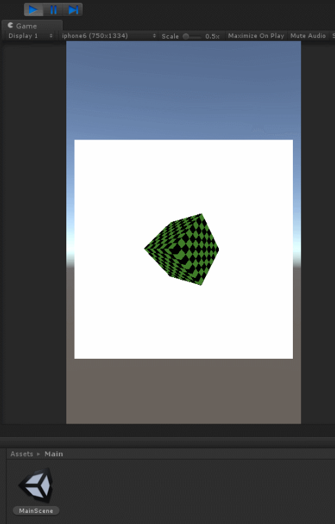

# 目录

<!-- TOC -->

- [目录](#%E7%9B%AE%E5%BD%95)
    - [零、开源项目](#%E9%9B%B6%E5%BC%80%E6%BA%90%E9%A1%B9%E7%9B%AE)
    - [一、知识](#%E4%B8%80%E7%9F%A5%E8%AF%86)
        - [C++](#c)
        - [算法](#%E7%AE%97%E6%B3%95)
        - [设计模式](#%E8%AE%BE%E8%AE%A1%E6%A8%A1%E5%BC%8F)
        - [安卓](#%E5%AE%89%E5%8D%93)
        - [SQLite](#sqlite)
        - [](#)
        - [计算机网络](#%E8%AE%A1%E7%AE%97%E6%9C%BA%E7%BD%91%E7%BB%9C)
        - [项目经历](#%E9%A1%B9%E7%9B%AE%E7%BB%8F%E5%8E%86)
    - [二、书籍](#%E4%BA%8C%E4%B9%A6%E7%B1%8D)
        - [计算机网络](#%E8%AE%A1%E7%AE%97%E6%9C%BA%E7%BD%91%E7%BB%9C)
            - [《图解http》](#%E5%9B%BE%E8%A7%A3http)
        - [GC回收](#gc%E5%9B%9E%E6%94%B6)
            - [《垃圾回收的算法和实现》](#%E5%9E%83%E5%9C%BE%E5%9B%9E%E6%94%B6%E7%9A%84%E7%AE%97%E6%B3%95%E5%92%8C%E5%AE%9E%E7%8E%B0)

<!-- /TOC -->

## 零、开源项目
- 软渲染器
1. UE4工程 给UE Programmer或者C++ Programmer 想了解图形学、渲染管线的coder
渲染一个正方体的效果

UE4工程：https://github.com/wlxklyh/SoftRenderer/tree/master/Unreal
主代码和注释：https://github.com/wlxklyh/SoftRenderer/blob/master/Unreal/Source/Graphic/SoftRenderer/ScreenDevice.h


2. Unity工程 给Unity Programmer或者C# Programmer 想了解图形学、渲染管线的coder
渲染一个正方体的效果

工程：https://github.com/wlxklyh/SoftRenderer/tree/master/Unity
主代码和注释：https://github.com/wlxklyh/SoftRenderer/blob/master/Unity/Assets/MainCode.cs


3. Android工程 给Android Programmer或者Java Programmer 想了解图形学、渲染管线的coder【TODO】

## 一、知识

### C++
- Volatile作用
类型修饰符 没有使用这个声明的 可能直接从CPU的寄存器里面直接取值 下面b=i的汇编会直接从寄存器里面读取值

变量i 没有关键字Volatile 那么是有编译器优化 1BDh直接把这个值算好在汇编里面


变量i 有关键字Volatile 那么是无编译器优化 


- 虚函数
1. 构造函数可以是虚函数吗？
不可以 因为调用虚函数的时候还没构造完这个对象 也就虚指针还没创建好 无法调用
2. 构造函数中调用虚函数会如何？
```Cpp
class A
{ 
    A(){fun()};
    virtual void fun(){cout<<"A fun"}
}
class B:public A
{
    B(){};
    virtual void fun(){cout<<"B fun"}
}
```
A的构造函数调用虚函数  输出的是A Fun  先调用A构造函数时输出 再调用B构造函数
析构函数调用顺序是先子类 后基类  虚函数的多态也会失效，虚表是在构造函数赋值的 基类构造所先赋值了基类的虚表 所以调用的是基类的虚函数  虚函数多态也就失效了虚表在构造基类 子类时绑定
3. 析构函数能够是虚函数
建议是因为 基类指针析构调用才可以调用到子类的析构函数 不然只调用基类的析构 没有调用子类析构从而子类内存泄露

4. 虚函数实现原理？虚表
    1. 同个类的所有对象的虚表是一样的 虚指针指向的地址一样 是同一张虚表
    2. 多继承才有多个虚指针
    3. 
```cpp
class A(){virtual Afun()}
class B(){virtual Afun()}
sizeof(B) = 4

class A(){virtual Afun()}
class B(){virtual Bfun()}
sizeof(B) = 4 为什么呢？
```

- 智能指针
 


### 算法

### 设计模式

### 安卓
- 双亲委托

### SQLite

###  


### [计算机网络](https://github.com/wlxklyh/book/blob/master/interview/neiwork/Main.md)

### 项目经历

## 二、书籍

### 计算机网络

#### [《图解http》](https://github.com/wlxklyh/book/blob/master/Book/GC/Main.md)

### GC回收

#### [《垃圾回收的算法和实现》](https://github.com/wlxklyh/book/blob/master/Book/neiwork/Study.md)
