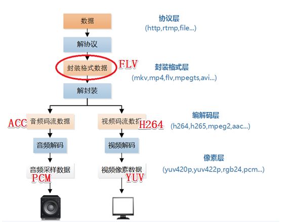
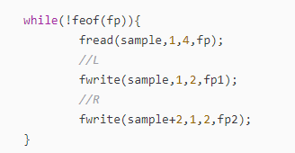
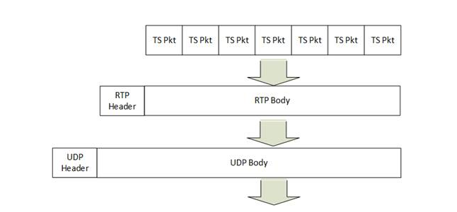

# FFmpeg

## 知识搜索
总的：https://blog.csdn.net/leixiaohua1020/article/details/15811977

## 一、音视频流基础
### 1、互联网视频文件
#### 解协议
网络传播用的是流媒体协议 HTTP RTMP MMS 解析为标准的相应的封装格式数据
#### 解封装
分离成音频流压缩编码数据 和 视频流压缩编码数据 例如FLV解封装为H.264编码的视频码流 和 AAC编码的音频码流
#### 解码音视频
解码为非压缩的视频、音频原始数据 音频的压缩编码标准包含  AAC  MP3  AC-3等  视频的压缩编码标准有H.264 MPEG2  VC-1  
压缩编码的视频数据输出成非压缩的颜色数据  YUV420p  RGB 
#### 音视频同步
同步解码出来的视频和音频数据 并将视频 音频数据送至 显卡和声卡

### 2、视频数据处理(一帧一帧的取数据)(裸数据)
https://blog.csdn.net/leixiaohua1020/article/details/50534150

1. YUV 420p 256x256x1byte 这个是Y分量亮度  色度U=128x128x1byte V=128x128x1byte 采样密度不一样
2. YUV 444p 256x256x1byte 这个是Y分量亮度  色度U=256x256x1byte V=256x256x1byte 采样密度一样
3. YUV 420p去掉颜色 memset(pic+wxh,128,wxh/2); 色度分量取值0至255，无色对应的就是128
4. YUV420P像素数据的亮度减半 取出Y 然后除以2
5. YUV420P格式的灰阶测试图 就是生成YUV（0，128,128）、（28，128,128）....（255，128,128）
6. PSNR：取值通常情况下都在20-50的范围内，取值越高，代表两张图像越接近，反映出受损图像质量越好。
MSE=两张图的差值的平方均值
.png)
7. 类似于YUV420的排布格式叫Planar 类似RGB24的排布格式叫Packed
8. 将RGB24格式像素数据封装为BMP图像：
BMP采用的是小端（Little Endian）存储方式。这种存储方式中存储的先后顺序为B、G、R。给RGB格式文件加BMP头和将RB数据调换
9. 将RGB24格式像素数据转换为YUV420P格式像素数据

10. 彩条侧视图

### 3、视音频数据处理入门：PCM音频采样数据处理(裸数据)
1. 分离PCM16LE双声道音频采样数据的左声道和右声道

16LE代表16bit 就是2byte LE是小端
数据格式：2Byte(左声道)2Byte(右声道)2Byte(左声道)2Byte(右声道)

2. 将PCM16LE双声道音频采样数据中左声道的音量降一半
这个就是读取数据 每4bytes读取 然后把前2bytes的值除以2

3. 将PCM16LE双声道音频采样数据的声音速度提高一倍
   简单的就是采样除以2  间隔着采样左右声道

4. 将PCM16LE双声道音频采样数据转换为PCM8音频采样数据
   除以 2^8次方 来处理

5. 将从PCM16LE单声道音频采样数据中截取一部分数据

6. 将PCM16LE双声道音频采样数据转换为WAVE格式音频数据
   该格式的实质就是在PCM文件的前面加了一个文件头

### 4、视音频数据处理入门：H.264视频码流解析(压缩)

每个NALU之间通过起始码进行间隔 起始码分成两种 0x000001 0x00000001
通过搜索搜索起始码 得到NALU

### 5、视音频数据处理入门：AAC音频码流解析(压缩)

其中ADTS通过syncword 进行间隔

### 6、视音频数据处理入门：FLV封装格式解析
FLV是由一个FLV Header和 一个一个Tag组成

### 7、视音频数据处理入门：UDP-RTP协议解析

## 二、FFMpeg
### 1、FFmpeg程序的使用
### 2、FFmpeg库的使用：视频播放器
### 3、FFmpeg库的使用：音频播放器
### 4、FFmpeg —— ffplay
### 5、FFmpeg：编码
### 6、ffmpeg源代码分析
### 7、FFmpeg其它几个类库